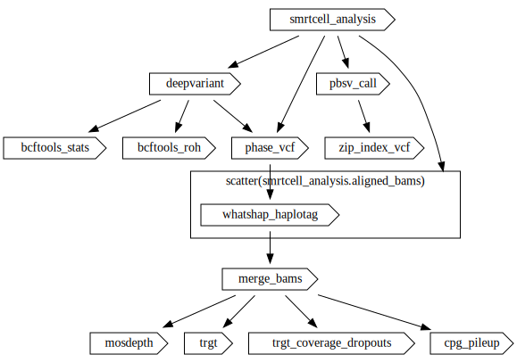
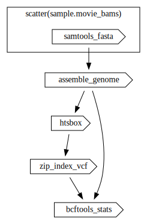
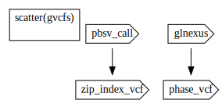
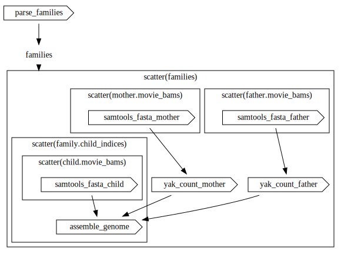
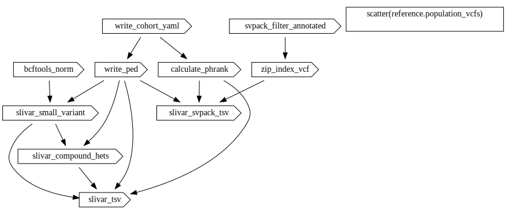
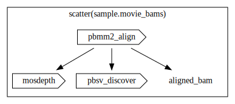
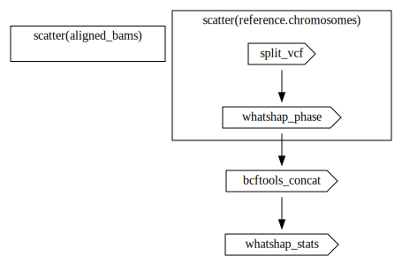
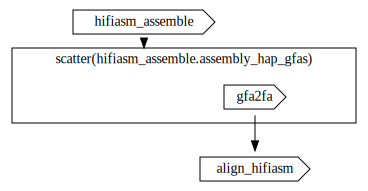

# wdl-humanwgs

Workflows for analyzing human PacBio WGS data. Performs read alignment, small and structural variant calling, variant phasing, and _de novo_ assembly.

- PacBio's human WGS workflow written in [Workflow Description Language (WDL)](https://openwdl.org/).

- For the snakemake version of these workflows, see [here](https://github.com/PacificBiosciences/pb-human-wgs-workflow-snakemake).

- Docker images used by these workflows are defined [here](https://github.com/PacificBiosciences/wdl-dockerfiles).

## Workflows

### Main

Calls all steps of the full analysis.

**Workflow**: [workflows/main.wdl](workflows/main.wdl)

**Inputs**: [workflows/inputs.json](workflows/inputs.json)

### Sample analysis (`sample_analysis`)

Run for each sample in the cohort. [Aligns reads from each movie to a reference](smrt-cell-analysis-smrtcell_analysis). Calls and phases small and structural variants.

**Workflow**: [workflows/sample_analysis/sample_analysis.wdl](workflows/sample_analysis/sample_analysis.wdl)

**Inputs**: [workflows/sample_analysis.inputs.json](workflows/sample_analysis/inputs.json)

### Single sample _de novo_ assembly

Assembles a single genome. This workflow is run if `Sample.run_de_novo_assembly` is set to `true`. Each sample can be independently assembled in this way.

**Workflow**: [workflows/de_novo_assembly_sample/de_novo_assembly_sample.wdl](workflows/de_novo_assembly_sample/de_novo_assembly_sample.wdl)

**Inputs**: [workflows/de_novo_assembly_sample/inputs.json](workflows/de_novo_assembly_sample/inputs.json)

### Cohort analysis

Runs joint genotyping for a cohort. This workflow will be run if there is more than one sample in the cohort.

**Workflow**: [workflows/cohort_analysis/cohort_analysis.wdl](workflows/cohort_analysis/cohort_analysis.wdl)

**Inputs**: [workflows/cohort_analysis/inputs.json](workflows/cohort_analysis/inputs.json)

### Trio _de novo_ assembly (`de_novo_assembly_trio`)

Performs _de novo_ assembly on a trio. Uses parental information and phasing to improve the assembly. This workflow will run if `Cohort.run_de_novo_assembly_trio` is set to `true`. The cohort must include a single valid trio (child, father, and mother).

**Workflow**: [workflows/de_novo_assembly_trio/de_novo_assembly_trio.wdl](workflows/de_novo_assembly_trio/de_novo_assembly_trio.wdl)

**Inputs**: [workflows/de_novo_assembly_trio/inputs.json](workflows/de_novo_assembly_trio/inputs.json)

### Tertiary analysis (`tertiary_analysis`)

Annotate small and structural variant VCFs using slivar. Outputs annotated VCFs and TSVs. This workflow is run on a phased single-sample VCF if there is only a single individual in the cohort, otherwise it is run on the joint-called phased VCF.

**Workflow**: [workflows/tertiary_analysis/tertiary_analysis.wdl](workflows/tertiary_analysis/tertiary_analysis.wdl)

**Inputs**: [workflows/tertiary_analysis/inputs.json](workflows/tertiary_analysis/inputs.json)

### Other workflows

#### Common

These are resources that are used across workflows, including [structs](workflows/common/structs.wdl) and [common tasks](workflows/common/tasks).

#### SMRT cell analysis (`smrtcell_analysis`)

Aligns reads to a reference genome and generates statistics on alignment depth, read length, and alignment quality. Called as part of [sample_analysis](#sample-analysis-sample_analysis).

**Workflow**: [workflows/smrtcell_analysis/smrtcell_analysis.wdl](workflows/smrtcell_analysis/smrtcell_analysis.wdl)

**Inputs**: [workflows/smrtcell_analysis/inputs.json](workflows/smrtcell_analysis/inputs.json)

#### VCF phasing (`phase_vcf`)

Phases and calculates stats for a VCF using WhatsHap. This step is run on both single-sample small variant VCFs and joint-called VCFs if the number of samples in the cohort is > 1.

**Workflow**: [workflows/phase_vcf/phase_vcf.wdl](workflows/phase_vcf/phase_vcf.wdl)

**Inputs**: [workflows/phase_vcf.inputs.json](workflows/phase_vcf/inputs.json)

#### Assemble genome (`assemble_genome`)

Assembles a genome using `hifiasm`. These steps are used in both single-sample- and trio-based _de novo_ assembly.

**Workflow**: [workflows/assemble_genome/assemble_genome.wdl](workflows/assemble_genome/assemble_genome.wdl)

**Inputs**: [workflows/assemble_genome/inputs.json](workflows/assemble_genome/inputs.json)

## Workflow inputs

### `Cohort cohort`

A cohort can include one or more samples. Samples need not be related.

- `String cohort_id`: A unique name for the cohort; used to name outputs
- `Array[Sample] samples`: The set of samples for the cohort; see [samples](#samples)
- `Array[String] phenotypes`: [HPO phenotypes](https://hpo.jax.org/app/) associated with the cohort
- `Boolean run_de_novo_assembly_trio`: Run trio-based _de novo_ assembly. Cohort must contain a valid trio (child and both parents present in the cohort)

#### Samples

- `String sample_id`: A unique name for the sample; used to name outputs
- `Array[IndexData] movie_bams`: The set of movie bams associated with this sample
- `String sex`: One of ["MALE", "FEMALE"]
- `Boolean affected`: The affected status for the sample
- `String? father_id`: Paternal `sample_id`, if available
- `String? mother_id`: Maternal `sample_id`, if available
- `Boolean run_de_novo_assembly`: Run single-sample _de novo_ assembly for this sample

### `ReferenceData reference`

- `String name`: Reference name; used to name outputs
- `IndexData fasta`: Reference genome and index to align reads to
- `Array[String] chromosomes`: Chromosomes to phase during WhatsHap phasing
- `File chromosome_lengths`: File specifying the lengths of each of the reference chromosomes
- `File tandem_repeat_bed`: Tandem repeat locations in the reference genome
- `File trgt_tandem_repeat_bed`: Repeat bed used by TRGT to output spanning reads and a repeat VCF
- `File gnomad_af`: gnomAD allele frequencies; used for annotate the small variant VCF
- `File hprc_af`: Allele frequences from the Human Pangenome Reference Consortium (HPRC); used to annotate the small variant VCF
- `File gff`: GFF3 annotation file
- `Array[IndexData] population_vcfs`: Population calls in VCF format; used to annotate the VCFs

### `SlivarData slivar_data`

Files associated with `slivar` annotation.

- `File slivar_js`: Additional javascript functions for slivar
- `File hpo_terms`, `File hpo_dag`, `File hpo_annotations`: HPO annotation lookups
- `File ensembl_to_hgnc`: Ensembl to HGNC gene mapping
- `File lof_lookup`, `File clinvar_lookup`: LOF and ClinVar lookup files for slivar annotations

### Other inputs

- `String deepvariant_version`: Version of deepvariant to use
- `DeepVariantModel? deepvariant_model`: Optional alternate DeepVariant model file to use; includes the model, model index, and model metadata
- `String backend`: Backend where the workflow will be executed ['GCP', 'Azure', 'AWS']
- `String? zones`: Zones where compute will take place; required if backend is set to 'AWS' or 'GCP'
- `String? aws_spot_queue_arn`: Queue ARN for the spot batch queue; required if backend is set to 'AWS'
- `String? aws_on_demand_queue_arn`: Queue ARN for the on demand batch queue; required if backend is set to 'AWS'

## Development

Install commit hooks by setting `git config core.hooksPath hooks/`.

`python3` is required to run the pre-commit hook; install required libraries using `python3 -m pip install -r hooks/scripts/requirements.txt`.
The pre-commit hook will generate a workfow graph visualization for each workflow in the `workflows` directory with the '.wdl' extension that is located in a directory that shares its name (e.g. `workflows/slivar/slivar.wdl` would be included, and `workflows/common/structs.wdl` would be excluded). A visualization for `workflows/main.wdl` will also be generated.
