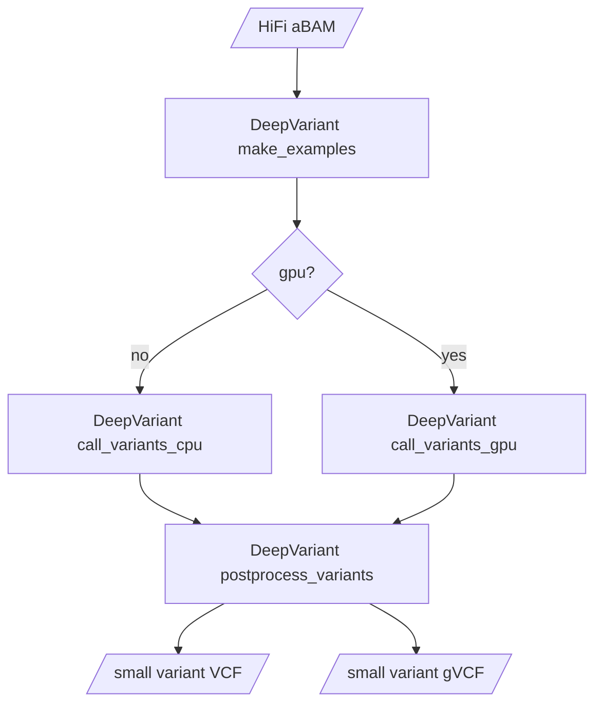

# DeepVariant subworkflow

This subworkflow runs the three steps of DeepVariant individually in order to make best use of resources.  If a GPU is available and `gpu==true`, the `call_variants` step will run on 1 GPU and 8 cpu threads, otherwise it will run on 64 CPU threads.  The `make_examples` and `postprocess_variants` steps will always run on the CPU.
