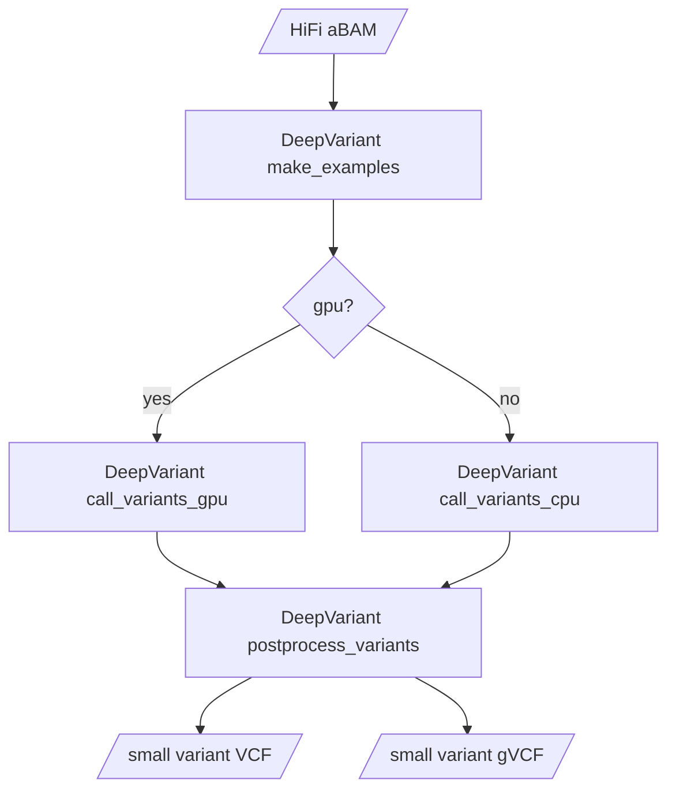

# DeepVariant subworkflow

```mermaid
flowchart TD
  aBAM[/"HiFi aBAM"/] --> make_examples["DeepVariant make_examples"]
  make_examples --> gpu{"gpu?"}
  gpu -- yes --> call_variants_gpu["DeepVariant call_variants_gpu"]
  gpu -- no --> call_variants_cpu["DeepVariant call_variants_cpu"]
  call_variants_gpu --> postprocess_variants["DeepVariant postprocess_variants"]
  call_variants_cpu --> postprocess_variants
  postprocess_variants --> vcf[/"small variant VCF"/]
  postprocess_variants --> gvcf[/"small variant gVCF"/]
```

This subworkflow runs the three steps of DeepVariant individually in order to make best use of resources. If a GPU is available and `use_gpu==true`, the `call_variants` step will run on 1GPU/8CPU/32GiB, otherwise it will run on 64CPU/256GiB. The `make_examples` and `postprocess_variants` steps will always run on the CPU. We run standard DeepVariant v1.10.0.

## Parabricks alternative

If `use_gpu` and `use_parabricks_deepvariant` are both set to `true`, this subworkflow is skipped entirely in favor of the [Parabricks DeepVariant subworkflow](parabricks.md), which replaces all three steps above with a single `pbrun deepvariant` call. Parabricks DeepVariant uses NVIDIA Clara Parabricks 4.7.0-1, which NVIDIA states is functionally equivalent to standard DeepVariant v1.9.0 — one version behind the standard DeepVariant we run directly. See [GPU support](gpu.md) for how to enable it.

The `clara-parabricks` container (see [Tool versions and Containers](tools_containers.md)) is pulled directly from NVIDIA's NGC registry rather than mirrored to our own Quay.io namespace. Pulling it requires an NGC account and an NGC API key:

- [Generating an NGC API key](https://docs.nvidia.com/ngc/latest/ngc-private-registry-user-guide.html#generating-ngc-api-keys)
- [Using the key to pull images with `docker login`](https://docs.nvidia.com/ngc/latest/ngc-private-registry-user-guide.html#using-ngc-container-registry-from-the-docker-command-line)
- [`clara-parabricks` on the NGC catalog](https://catalog.ngc.nvidia.com/orgs/nvidia/teams/clara/containers/clara-parabricks)
