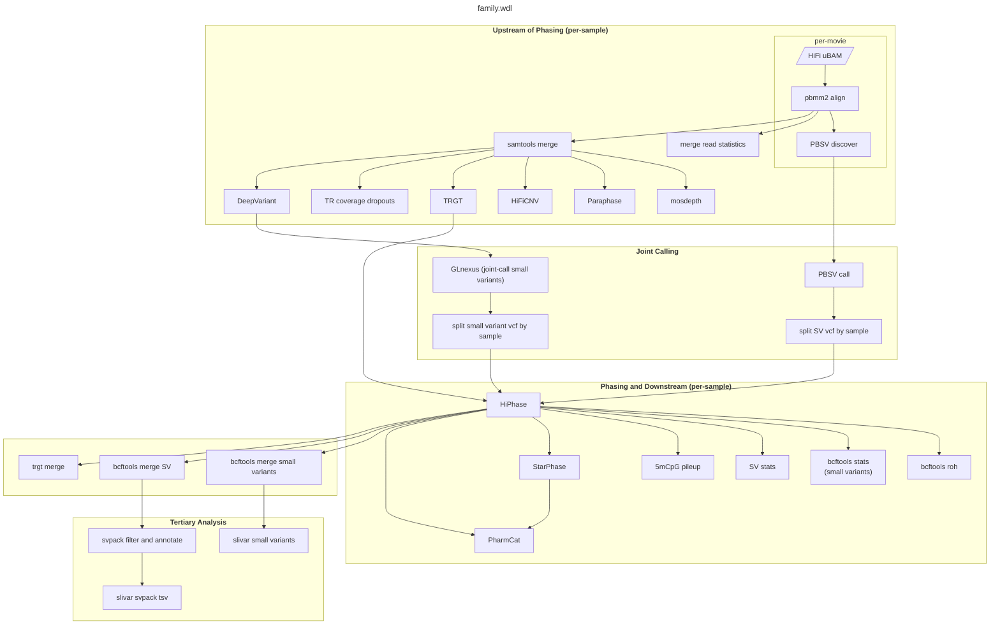

# family.wdl inputs and outputs

- [family.wdl inputs and outputs](#familywdl-inputs-and-outputs)
  - [DAG (simplified)](#dag-simplified)
  - [Inputs](#inputs)
    - [Family Struct](#family-struct)
    - [Sample Struct](#sample-struct)
  - [Outputs](#outputs)
    - [Alignments, Coverage, and QC](#alignments-coverage-and-qc)
    - [Small Variants (\<50 bp)](#small-variants-50-bp)
    - [Structural Variants (≥50 bp)](#structural-variants-50-bp)
    - [Copy Number Variants (≥100 kb)](#copy-number-variants-100-kb)
    - [Tandem Repeat Genotyping](#tandem-repeat-genotyping)
    - [Variant Phasing](#variant-phasing)
    - [Variant Calling in Dark Regions](#variant-calling-in-dark-regions)
    - [5mCpG Methylation Calling](#5mcpg-methylation-calling)
    - [PGx Typing](#pgx-typing)
    - [Tertiary Analysis](#tertiary-analysis)

## DAG (simplified)

## Inputs

| Type | Name | Description | Notes |
| ---- | ---- | ----------- | ----- |
| [Family](https://github.com/PacificBiosciences/HiFi-human-WGS-WDL/blob/main/workflows/humanwgs_structs.wdl#L15) | family | Family struct describing samples, relationships, and unaligned BAM paths | [below](#family-struct) |
| File | [ref_map_file](./ref_map) | TSV containing reference genome file paths; must match backend |  |
| String? | phenotypes | Comma-delimited list of HPO terms. | [Human Phenotype Ontology (HPO) phenotypes](https://hpo.jax.org/app/) associated with the cohort.  If omitted, tertiary analysis will be skipped. |
| File? | [tertiary_map_file](./tertiary_map) | TSV containing tertiary analysis file paths and thresholds; must match backend | `AF`/`AC`/`nhomalt` thresholds can be modified, but this will affect performance.  If omitted, tertiary analysis will be skipped. |
| Int? | glnexus_mem_gb | Override GLnexus memory; optional |  |
| Int? | pbsv_call_mem_gb | Override PBSV call memory; optional |  |
| Boolean | gpu | Use GPU when possible  Default: `false` | [GPU support](./gpu#gpu-support) |
| String | backend | Backend where the workflow will be executed  `["GCP", "Azure", "AWS-HealthOmics", "HPC"]` |  |
| String? | zones | Zones where compute will take place; required if backend is set to 'AWS' or 'GCP'. | [Determining available zones in GCP](./backends/gcp#determining-available-zones) |
| String? | gpuType | GPU type to use; required if gpu is set to `true` for cloud backends; must match backend  | [Available GPU types](./gpu#gpu-types) |
| String? | container_registry | Container registry where workflow images are hosted.  Default: `"quay.io/pacbio"` | If omitted, [PacBio's public Quay.io registry](https://quay.io/organization/pacbio) will be used.  Custom container_registry must be set if backend is set to 'AWS-HealthOmics'. |
| Boolean | preemptible | Where possible, run tasks preemptibly  `[true, false]`  Default: `true` | If set to `true`, run tasks preemptibly where possible. If set to `false`, on-demand VMs will be used for every task. Ignored if backend is set to HPC. |

### Family Struct

The `Family` struct contains the samples for the family. The struct has the following fields:

| Type | Name | Description | Notes |
| ---- | ---- | ----------- | ----- |
| String | family_id | Unique identifier for the family | Alphanumeric characters, periods, dashes, and underscores are allowed. |
| Array\[[Sample](https://github.com/PacificBiosciences/HiFi-human-WGS-WDL/blob/main/workflows/humanwgs_structs.wdl#L3)\] | samples | Sample struct with sample specific data and metadata. | [below](#sample-struct) |

### Sample Struct

The `Sample` struct contains sample specific data and metadata. The struct has the following fields:

| Type | Name | Description | Notes |
| ---- | ---- | ----------- | ----- |
| String | sample_id | Unique identifier for the sample | Alphanumeric characters, periods, dashes, and underscores are allowed. |
| String? | sex | Sample sex `["MALE", "FEMALE", null]` | Used by HiFiCNV and TRGT for genotyping. Allosome karyotype will default to XX unless sex is specified as `"MALE"`.  Used for tertiary analysis X-linked inheritance filtering. |
| Boolean | affected | Affected status | If set to `true`, sample is described as being affected by all HPO terms in `phenotypes`. If set to `false`, sample is described as not being affected by all HPO terms in `phenotypes`. |
| Array\[File\] | hifi_reads | Array of paths to HiFi reads in unaligned BAM format. |  |
| String? | father_id | sample_id of father (optional) |  |
| String? | mother_id | sample_id of mother (optional) |  |

## Outputs

### Alignments, Coverage, and QC

| Type | Name | Description | Notes |
| ---- | ---- | ----------- | ----- |
| String | workflow_name | Workflow name |  |
| String | workflow_version | Workflow version |  |
| Array\[String\] | sample_ids | Sample IDs |  |
| File | stats_file | Table of summary statistics |  |
| Array\[File\] | bam_stats | BAM stats | Per-read length and read-quality |
| Array\[File\] | read_length_plot | Read length plot |  |
| Array\[File\] | read_quality_plot | Read quality plot |  |
| Array\[File\] | merged_haplotagged_bam | Merged, haplotagged alignments | Includes unmapped reads |
| Array\[File\] | merged_haplotagged_bam_index |  |  |
| Array\[File\] | mosdepth_summary | Summary of aligned read depth. |  |
| Array\[File\] | mosdepth_region_bed | Median aligned read depth by 500bp windows. |  |
| Array\[File\] | mosdepth_region_bed_index |  |  |
| Array\[File\] | mosdepth_depth_distribution_plot |  |  |
| Array\[File\] | mapq_distribution_plot | Distribution of mapping quality per alignment | |
| Array\[File\] | mg_distribution_plot | Distribution of gap-compressed identity score per alignment | |
| Array\[String\] | stat_num_reads | Number of reads |  |
| Array\[String\] | stat_read_length_mean | Mean read length |  |
| Array\[String\] | stat_read_length_median | Median read length |  |
| Array\[String\] | stat_read_quality_mean | Mean read quality |  |
| Array\[String\] | stat_read_quality_median | Median read quality |  |
| Array\[String\] | stat_mapped_read_count | Count of reads mapped to reference |  |
| Array\[String\] | stat_mapped_percent | Percent of reads mapped to reference |  |
| Array\[String\] | inferred_sex | Inferred sex | Sex is inferred based on relative depth of chrY alignments. |
| Array\[String\] | stat_mean_depth | Mean depth | |

### Small Variants (<50 bp)

| Type | Name | Description | Notes |
| ---- | ---- | ----------- | ----- |
| Array\[File\] | phased_small_variant_vcf | Phased small variant VCF |  |
| Array\[File\] | phased_small_variant_vcf_index |  |  |
| Array\[File\] | small_variant_gvcf | Small variant GVCF | Can be used for joint-calling. |
| Array\[File\] | small_variant_gvcf_index |  |  |
| Array\[File\] | small_variant_stats | Small variant stats | Generated by `bcftools stats`. |
| Array\[String\] | stat_small_variant_SNV_count | SNV count | (PASS variants) |
| Array\[String\] | stat_small_variant_INDEL_count | INDEL count | (PASS variants) |
| Array\[String\] | stat_small_variant_TSTV_ratio | Ts/Tv ratio | (PASS variants) |
| Array\[String\] | stat_small_variant_HETHOM_ratio | Het/Hom ratio | (PASS variants) |
| Array\[File\] | snv_distribution_plot | Distribution of SNVs by REF, ALT | |
| Array\[File\] | indel_distribution_plot | Distribution of indels by size | |
| File? | joint_small_variants_vcf | Joint-called small variant VCF |  |
| File? | joint_small_variants_vcf_index |  |  |

### Structural Variants (≥50 bp)

| Type | Name | Description | Notes |
| ---- | ---- | ----------- | ----- |
| Array\[File\] | phased_sv_vcf | Phased structural variant VCF |  |
| Array\[File\] | phased_sv_vcf_index | Index for phased structural variant VCF |  |
| Array\[String\] | stat_sv_DUP_count | Structural variant DUP count | (PASS variants) |
| Array\[String\] | stat_sv_DEL_count | Structural variant DEL count | (PASS variants) |
| Array\[String\] | stat_sv_INS_count | Structural variant INS count | (PASS variants) |
| Array\[String\] | stat_sv_INV_count | Structural variant INV count | (PASS variants) |
| Array\[String\] | stat_sv_BND_count | Structural variant BND count | (PASS variants) |
| Array\[File\] | bcftools_roh_out | ROH calling |  `bcftools roh` |
| Array\[File\] | bcftools_roh_bed | Generated from above, without filtering |  |
| File? | joint_sv_vcf | Joint-called structural variant VCF |  |
| File? | joint_sv_vcf_index |  |  |

### Copy Number Variants (≥100 kb)

| Type | Name | Description | Notes |
| ---- | ---- | ----------- | ----- |
| Array\[File\] | cnv_vcf | CNV VCF |  |
| Array\[File\] | cnv_vcf_index | Index for CNV VCF |  |
| Array\[File\] | cnv_copynum_bedgraph | CNV copy number BEDGraph |  |
| Array\[File\] | cnv_depth_bw | CNV depth BigWig |  |
| Array\[File\] | cnv_maf_bw | CNV MAF BigWig |  |
| Array\[String\] | stat_cnv_DUP_count | Count of DUP events | (for PASS variants) |
| Array\[String\] | stat_cnv_DEL_count | Count of DEL events | (PASS variants) |
| Array\[String\] | stat_cnv_DUP_sum | Sum of DUP bp | (PASS variants) |
| Array\[String\] | stat_cnv_DEL_sum | Sum of DEL bp | (PASS variants) |

### Tandem Repeat Genotyping

| Type | Name | Description | Notes |
| ---- | ---- | ----------- | ----- |
| Array\[File\] | phased_trgt_vcf | Phased TRGT VCF |  |
| Array\[File\] | phased_trgt_vcf_index |  |  |
| Array\[File\] | trgt_spanning_reads | TRGT spanning reads |  |
| Array\[File\] | trgt_spanning_reads_index |  |  |
| Array\[String\] | stat_trgt_genotyped_count | Count of genotyped sites |  |
| Array\[String\] | stat_trgt_uncalled_count | Count of ungenotyped sites |  |

### Variant Phasing

| Type | Name | Description | Notes |
| ---- | ---- | ----------- | ----- |
| Array\[File\] | phase_stats | Phasing stats |  |
| Array\[File\] | phase_blocks | Phase blocks |  |
| Array\[File\] | phase_haplotags | Per-read haplotag assignment |  |
| Array\[String\] | stat_phased_basepairs | Count of bp within phase blocks |  |
| Array\[String\] | stat_phase_block_ng50 | Phase block NG50 |  |

### Variant Calling in Dark Regions

| Type | Name | Description | Notes |
| ---- | ---- | ----------- | ----- |
| Array\[File\] | paraphase_output_json | Paraphase output JSON |  |
| Array\[File\] | paraphase_realigned_bam | Paraphase realigned BAM |  |
| Array\[File\] | paraphase_realigned_bam_index |  |  |
| Array\[File?\] | paraphase_vcfs | Paraphase VCFs | Compressed as `.tar.gz` |

### 5mCpG Methylation Calling

| Type | Name | Description | Notes |
| ---- | ---- | ----------- | ----- |
| Array\[File\] | cpg_hap1_bed | CpG hap1 BED |  |
| Array\[File\] | cpg_hap1_bed_index |  |  |
| Array\[File\] | cpg_hap2_bed | CpG hap2 BED |  |
| Array\[File\] | cpg_hap2_bed_index |  |  |
| Array\[File\] | cpg_combined_bed | CpG combined BED |  |
| Array\[File\] | cpg_combined_bed_index |  |  |
| Array\[File\] | cpg_hap1_bw | CpG hap1 BigWig |  |
| Array\[File\] | cpg_hap2_bw | CpG hap2 BigWig |  |
| Array\[File\] | cpg_combined_bw | CpG combined BigWig |  |
| Array\[String\] | stat_cpg_hap1_count | Hap1 CpG count |  |
| Array\[String\] | stat_cpg_hap2_count | Hap2 CpG count |  |
| Array\[String\] | stat_cpg_combined_count | Combined CpG count |  |

### PGx Typing

| Type | Name | Description | Notes |
| ---- | ---- | ----------- | ----- |
| Array\[File\] | pbstarphase_json | PBstarPhase JSON | Haplotype calls for PGx loci |
| Array\[File\] | pharmcat_match_json | PharmCAT match JSON |  |
| Array\[File\] | pharmcat_phenotype_json | PharmCAT phenotype JSON |  |
| Array\[File\] | pharmcat_report_html | PharmCAT report HTML |  |
| Array\[File\] | pharmcat_report_json | PharmCAT report JSON |  |

### Tertiary Analysis

| Type | Name | Description | Notes |
| ---- | ---- | ----------- | ----- |
| File? | pedigree | Pedigree file in PLINK PED [format](https://zzz.bwh.harvard.edu/plink/data.shtml#ped) |  |
| File? | small_variant_filtered_vcf | Filtered, annotated small variant VCF |  |
| File? | small_variant_filtered_vcf_index |  |  |
| File? | small_variant_filtered_tsv | Filtered, annotated small variant calls |  |
| File? | small_variant_compound_het_vcf | Filtered, annotated compound heterozygous small variant VCF |  |
| File? | small_variant_compound_het_vcf_index |  |  |
| File? | small_variant_compound_het_tsv | Filtered, annotated compound heterozygous small variant calls |  |
| File? | sv_filtered_vcf | Filtered, annotated structural variant VCF |  |
| File? | sv_filtered_vcf_index |  |  |
| File? | sv_filtered_tsv | Filtered, annotated structural variant TSV |  |
