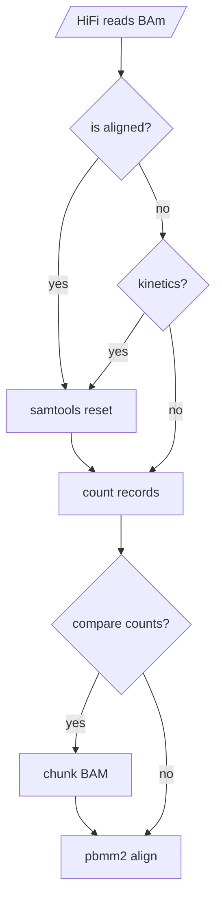

# pbmm2 alignment Subworkflow

This subworkflow checks an input BAM for evidence of alignment or kinetics. If it finds either of these, it strips alignment and kinetics information.  Next, it counts the number of records in the BAM, and if  chunking is enabled and the number of records is greater than `max_reads_per_chunk`, the BAM is split into chunks of no larger than `max_reads_per_chunk`. Finally, chunks are aligned to the reference with pbmm2.
