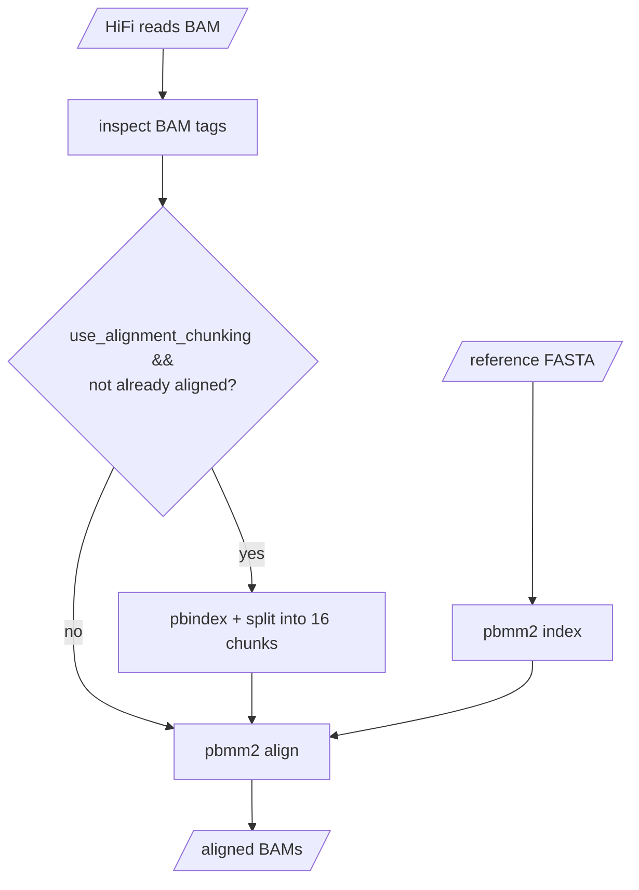

# pbmm2 alignment Subworkflow

```mermaid
flowchart TD
  hifi_reads[/"HiFi reads BAM"/] --> inspect["inspect BAM tags"]
  ref_fasta[/"reference FASTA"/] --> create_index["pbmm2 index"]
  inspect --> chunk{"use_alignment_chunking &&\nnot already aligned?"}
  chunk -- yes --> pbindex["pbindex + split into 16 chunks"]
  chunk -- no --> align["pbmm2 align"]
  pbindex --> align
  create_index --> align
  align --> aligned_bams[/"aligned BAMs"/]
```

This subworkflow aligns (or re-aligns) HiFi reads to a reference genome with `pbmm2`.

1. `create_pbmm2_index` builds a `pbmm2` `.mmi` index from `ref_fasta`.
2. `index_input_bam` inspects up to the first 10,000 records of the input BAM for evidence of alignment, consensus kinetics, and base-modification tags, and emits informational messages about what it finds (e.g. that alignment/kinetics tags will be stripped, or that no 5mCpG pileups will be generated). If `use_alignment_chunking` is `true` and the BAM is not already aligned, it also builds a `pbindex` and requests 16 chunks for parallel alignment; otherwise chunking is disabled.
3. The workflow scatters over the requested chunks (or runs once, unchunked, if chunking is disabled) and calls `pbmm2_align_wgs` for each. Alignment always strips the `HP`/`PS`/`PC` haplotype tags and, by default, consensus kinetics tags; it keeps unmapped reads and drops alignments shorter than 50bp. When chunked, each task aligns only its `--chunk` of the input via `pbmm2 align --chunk-mode scatter`.

To disable chunking, set `use_alignment_chunking` to `false`.
