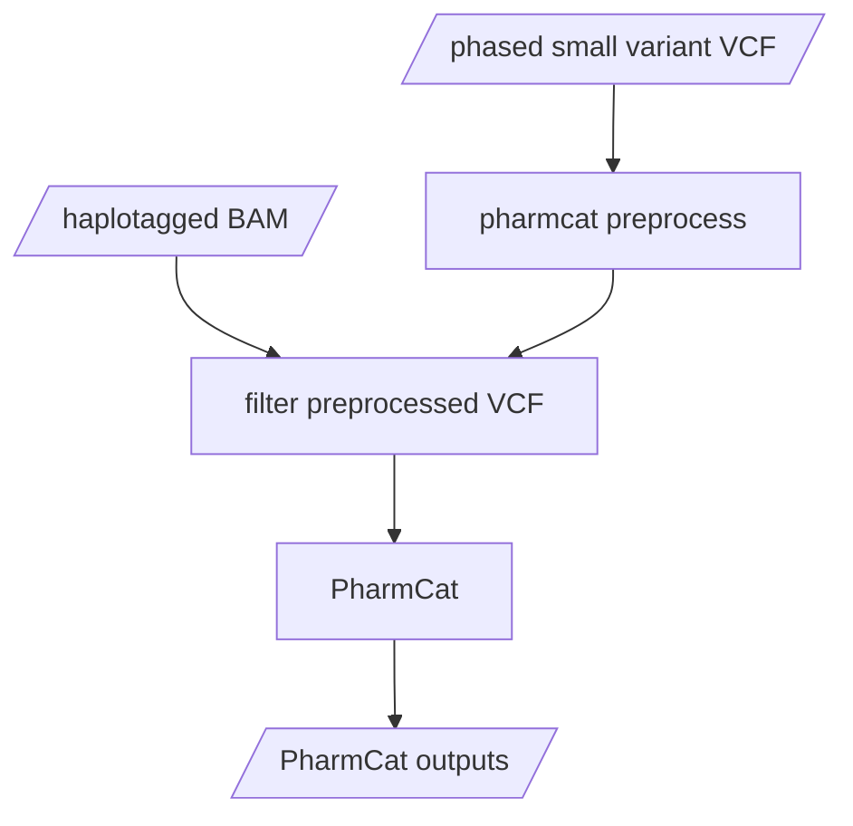

# PharmCat subworkflow

[PharmCat (Pharmacogenomics Clinical Annotation Tool)](https://pharmcat.org) analyzes genetic variants and predicts drug response.  In this subworkflow implementation, PharmCat will use a combination of the small variant VCF and pbStarPhase outupts.  PharmCat outputs will only be generated if the depth at the variant position is greater than `pharmcat_min_coverage` (default `10`).  If no variants pass this filter, no outputs will be generated.

Citation: K Sangkuhl & M Whirl-Carrillo, et al. Pharmacogenomics Clinical Annotation Tool (PharmCAT). Clinical Pharmacology & Therapeutics (2020) 107(1):203-210. [https://www.ncbi.nlm.nih.gov/pmc/articles/PMC6977333](https://www.ncbi.nlm.nih.gov/pmc/articles/PMC6977333).
