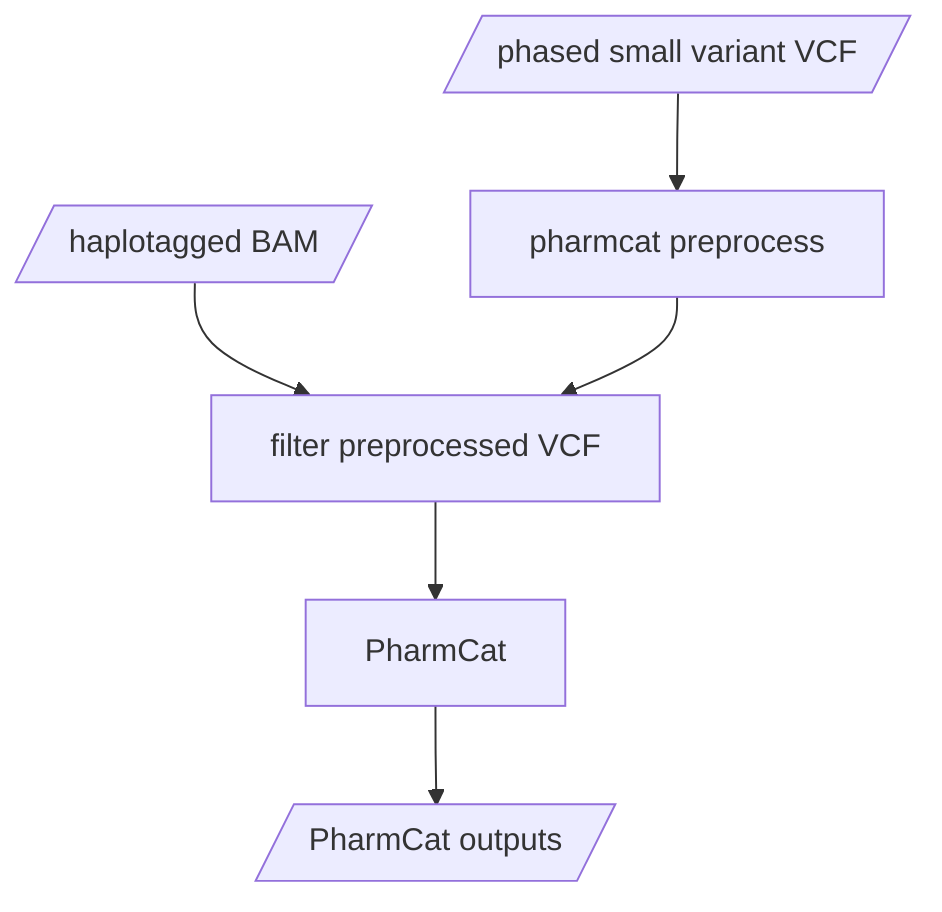

# PharmCat subworkflow

```mermaid
flowchart TD
  a1[/"phased small variant VCF"/] --> b1["pharmcat preprocess"]
  a2[/"haplotagged BAM"/] --> b3["filter preprocessed VCF"]
  b1 --> b3
  b3 --> b4["PharmCat"]
  b4 --> b5[/"PharmCat outputs"/]
```
