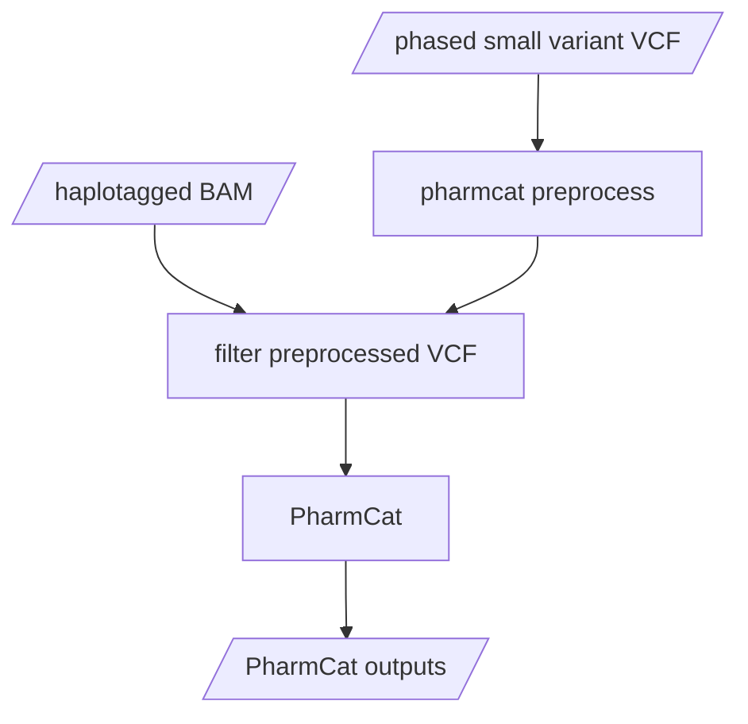

# PharmCat subworkflow

```mermaid
flowchart TD
  phased_vcf[/"phased small variant VCF"/] --> preprocess["pharmcat preprocess"]
  aBAM[/"haplotagged BAM"/] --> filter["filter preprocessed VCF"]
  preprocess --> filter
  filter --> pharmcat["PharmCat"]
  pharmcat --> outputs[/"PharmCat outputs"/]
```
