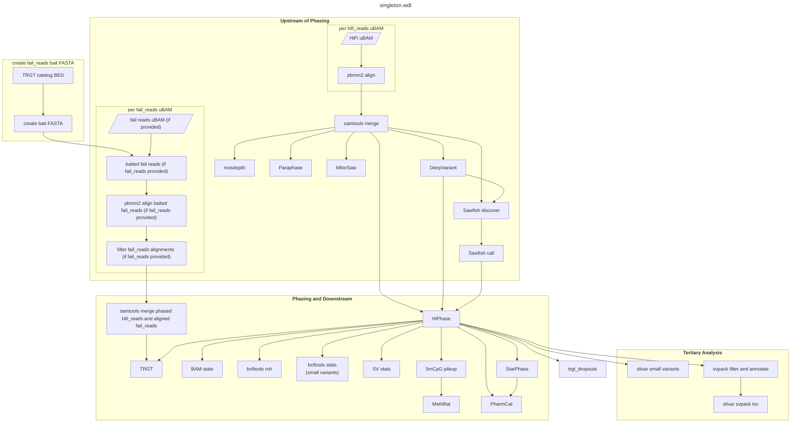

# singleton.wdl inputs and outputs

- [singleton.wdl inputs and outputs](#singletonwdl-inputs-and-outputs)
  - [DAG (simplified)](#dag-simplified)
  - [Inputs](#inputs)
  - [Outputs](#outputs)
    - [Alignments, Coverage, and QC](#alignments-coverage-and-qc)
    - [Small Variants (\<50 bp)](#small-variants-50-bp)
    - [Structural Variants (≥50 bp)](#structural-variants-50-bp)
    - [Tandem Repeat Genotyping](#tandem-repeat-genotyping)
    - [Variant Phasing](#variant-phasing)
    - [Variant Calling in Dark Regions](#variant-calling-in-dark-regions)
    - [5mCpG Methylation Calling](#5mcpg-methylation-calling)
    - [PGx Typing](#pgx-typing)
    - [Tertiary Analysis](#tertiary-analysis)

## DAG (simplified)

```mermaid
---
title: singleton.wdl
---
flowchart TD
  subgraph "create fail_reads bait FASTA"
    trgt_catalog["TRGT catalog BED"]
    bait_fasta["create bait FASTA"]
  end
  subgraph "`**Upstream of Phasing**`"
    subgraph "per hifi_reads uBAM"
      ubam[/"HiFi uBAM"/]
      pbmm2_align["pbmm2 align"]
    end
    subgraph "per fail_reads uBAM"
      fail_ubam[/"fail reads uBAM (if provided)"/]
      bait_fail_reads["baited fail reads (if fail_reads provided)"]
      pbmm2_align_fail_reads["pbmm2 align baited fail_reads (if fail_reads provided)"]
      filter_fail_reads["filter fail_reads alignments (if fail_reads provided)"]
    end
    samtools_merge["samtools merge"]
    mosdepth["mosdepth"]
    paraphase["Paraphase"]
    mitorsaw["MitorSaw"]
    deepvariant["DeepVariant"]
    sawfish_discover["Sawfish discover"]
    sawfish_call["Sawfish call"]
  end
  subgraph "`**Phasing and Downstream**`"
    hiphase["HiPhase"]
    samtools_merge_fail_reads["samtools merge phased hifi_reads and aligned fail_reads"]
    trgt["TRGT"]
    bam_stats["BAM stats"]
    bcftools_roh["bcftools roh"]
    bcftools_stats["bcftools stats\n(small variants)"]
    sv_stats["SV stats"]
    cpg_pileup["5mCpG pileup"]
    methbat["MethBat"]
    starphase["StarPhase"]
    pharmcat["PharmCat"]
  end
  subgraph "`**Tertiary Analysis**`"
    slivar_small_variants["slivar small variants"]
    svpack["svpack filter and annotate"]
    slivar_svpack["slivar svpack tsv"]
  end

  trgt_catalog --> bait_fasta --> bait_fail_reads
  fail_ubam --> bait_fail_reads --> pbmm2_align_fail_reads --> filter_fail_reads --> samtools_merge_fail_reads
  ubam --> pbmm2_align --> samtools_merge
  samtools_merge --> mosdepth
  samtools_merge --> paraphase
  samtools_merge --> mitorsaw
  samtools_merge_fail_reads --> trgt
  samtools_merge --> deepvariant
  samtools_merge --> sawfish_discover
  samtools_merge --> hiphase
  deepvariant --> sawfish_discover
  deepvariant --> hiphase
  sawfish_discover --> sawfish_call --> hiphase

  hiphase --> trgt
  hiphase --> bam_stats
  hiphase --> bcftools_roh
  hiphase --> bcftools_stats
  hiphase --> sv_stats
  hiphase --> cpg_pileup
  hiphase --> starphase
  hiphase --> pharmcat
  hiphase --> trgt_dropouts
  starphase --> pharmcat
  cpg_pileup --> methbat

  hiphase --> slivar_small_variants
  hiphase --> svpack
  svpack --> slivar_svpack
```

## Inputs

| Type | Name | Description | Notes |
| ---- | ---- | ----------- | ----- |
| String | sample_id | Unique identifier for the sample | Alphanumeric characters, periods, dashes, and underscores are allowed. |
| String? | sex | Sample sex `["MALE", "FEMALE"]` | Used by HiFiCNV and TRGT for genotyping. Allosome karyotype will default to XX unless sex is specified as `"MALE"`. |
| Array\[File\] | hifi_reads | Array of paths to hifi_reads in unaligned BAM format. | |
| Array\[File\]? | fail_reads | Array of paths to fail_reads in unaligned BAM format (optional) | If provided, these reads will be aligned to the bait-captured regions. |
| File | [ref_map_file](./ref_map.md) | TSV containing reference genome file paths; must match backend | |
| String? | phenotypes | Comma-delimited list of HPO terms. | [Human Phenotype Ontology (HPO) phenotypes](https://hpo.jax.org/app/) associated with the cohort.  If omitted, tertiary analysis will be skipped. |
| File? | [tertiary_map_file](./tertiary_map.md) | TSV containing tertiary analysis file paths and thresholds; must match backend | `AF`/`AC`/`nhomalt` thresholds can be modified, but this will affect performance.  If omitted, tertiary analysis will be skipped. |
| Int | max_reads_per_alignment_chunk | Maximum reads per alignment chunk  Default: `500000` | |
| Int | pharmcat_min_coverage | Minimum coverage for PharmCAT  Default: `10` | |
| Boolean | use_gpu | Use GPU when possible  Default: `false` | [GPU support](./gpu.md#gpu-support) |
| Boolean | use_parabricks_deepvariant | Use Parabricks DeepVariant implementation  Default: `false` | If both `use_parabricks_deepvariant` and `use_gpu` are set to `true`, Parabricks DeepVariant will be used instead of standard DeepVariant.  [Parabricks DeepVariant](./parabricks.md#parabricks-deepvariant-subworkflow) |
| String | backend | Backend where the workflow will be executed  `["GCP", "Azure", "AWS-HealthOmics", "HPC"]` | |
| String? | zones | Zones where compute will take place; required if backend is set to 'GCP' | [Determining available zones in GCP](./backend-gcp.md#determining-available-zones) |
| String? | cpuPlatform | Minimum CPU platform to use for tasks on GCP | Optional, only necessary in certain zones lacking n1 nodes. |
| String? | gpuType | GPU type to use; required if use_gpu is set to `true` for cloud backends; must match backend | [Available GPU types](./gpu.md#gpu-types) |
| String? | container_registry | Container registry where workflow images are hosted.  Default: `"quay.io/pacbio"` | If omitted, [PacBio's public Quay.io registry](https://quay.io/organization/pacbio) will be used.  Custom container_registry must be set if backend is set to 'AWS-HealthOmics'. |
| Boolean | preemptible | Where possible, run tasks preemptibly  `[true, false]`  Default: `true` | If set to `true`, run tasks preemptibly where possible. If set to `false`, on-demand VMs will be used for every task. Ignored if backend is set to HPC. |
| String? | debug_version | Debug version for testing purposes | |

## Outputs

### Alignments, Coverage, and QC

| Type | Name | Description | Notes |
| ---- | ---- | ----------- | ----- |
| String | workflow_name | Workflow name | |
| String | workflow_version | Workflow version | |
| Array\[String\] | msg | Messages from the workflow | |
| File | msg_file | File containing messages from the workflow | |
| File | stats_file | Table of summary statistics | |
| File | bam_statistics | BAM statistics | Per-read length and read-quality |
| File | read_length_plot | Distribution of read lengths | |
| File? | read_quality_plot | Distribution of read qualities | |
| File | merged_haplotagged_bam | Merged, haplotagged alignments | Includes unmapped reads |
| File | merged_haplotagged_bam_index | | |
| File | mosdepth_summary | Summary of aligned read depth | |
| File | mosdepth_region_bed | Median aligned read depth by 500bp windows | |
| File | mosdepth_region_bed_index | | |
| File | mosdepth_depth_distribution_plot | Distribution of aligned read depth | |
| File | mapq_distribution_plot | Distribution of mapping quality per alignment | |
| File | mg_distribution_plot | Distribution of gap-compressed identity per alignment | |
| String | stat_read_count | Number of reads | |
| String | stat_read_length_mean | Mean read length | |
| String | stat_read_length_median | Median read length | |
| String | stat_read_length_n50 | Read length N50 | |
| String | stat_read_quality_mean | Mean read quality | |
| String | stat_read_quality_median | Median read quality | |
| String | stat_mapped_read_count | Number of reads mapped to reference | |
| String | stat_mapped_read_percent | Percent of reads mapped to reference | |
| String | stat_gap_compressed_identity_mean | Mean gap-compressed identity | |
| String | stat_gap_compressed_identity_median | Median gap-compressed identity | |
| String | inferred_sex | Inferred sex | Sex is inferred based on relative depth of chrY alignments. |
| String | stat_depth_mean | Mean depth | |

### Small Variants (<50 bp)

| Type | Name | Description | Notes |
| ---- | ---- | ----------- | ----- |
| File | phased_small_variant_vcf | Phased small variant VCF | |
| File | phased_small_variant_vcf_index | | |
| File? | small_variant_gvcf | Small variant GVCF | Can be used for joint-calling. |
| File? | small_variant_gvcf_index | | |
| File | small_variant_stats | Small variant statistics | Generated by `bcftools stats`. |
| String | stat_small_variant_SNV_count | Number of SNVs | (PASS variants) |
| String | stat_small_variant_INDEL_count | Number of INDELs | (PASS variants) |
| String | stat_small_variant_TSTV_ratio | Ts/Tv ratio | (PASS variants) |
| String | stat_small_variant_HETHOM_ratio | Het/Hom ratio for SNVs | (PASS variants) |
| File | snv_distribution_plot | Distribution of SNVs by REF, ALT | |
| File | indel_distribution_plot | Distribution of indels by size | |

### Structural Variants (≥50 bp)

| Type | Name | Description | Notes |
| ---- | ---- | ----------- | ----- |
| File | phased_sv_vcf | Phased structural variant VCF | |
| File | phased_sv_vcf_index | Index for phased structural variant VCF | |
| String | stat_sv_DUP_count | Number of DUP structural variants | (PASS variants) |
| String | stat_sv_DEL_count | Number of DEL structural variants | (PASS variants) |
| String | stat_sv_INS_count | Number of INS structural variants | (PASS variants) |
| String | stat_sv_INV_count | Number of INV structural variants | (PASS variants) |
| String | stat_sv_BND_count | Number of BND structural variants | (PASS variants) |
| String | stat_sv_SWAP_count | Number of structural variant sequence swap events | (PASS variants) |
| File | sv_supporting_reads | Supporting reads for structural variants | |
| File | sv_copynum_bedgraph | CNV copy number BEDGraph | |
| File | sv_depth_bw | CNV depth BigWig | |
| File | sv_gc_bias_corrected_depth_bw | CNV GC-bias corrected depth BigWig | |
| File | sv_maf_bw | CNV MAF BigWig | |
| File | sv_copynum_summary | CNV copy number summary JSON | |
| File | bcftools_roh_out | Regions of homozygosity | `bcftools roh` |
| File | bcftools_roh_bed | Regions of homozygosity BED | |

### Mitochondrial variants and haplotypes

| Type | Name | Description | Notes |
| ---- | ---- | ----------- | ----- |
| File | mitorsaw_vcf | Mitochondrial variant VCF | |
| File | mitorsaw_vcf_index | Index for mitochondrial variant VCF | |
| File | mitorsaw_hap_stats | Mitochondrial haplotype statistics | |

### Tandem Repeat Genotyping

| Type | Name | Description | Notes |
| ---- | ---- | ----------- | ----- |
| File | phased_trgt_vcf | Phased TRGT VCF | |
| File | phased_trgt_vcf_index | | |
| File | trgt_spanning_reads | Aligned TRGT spanning reads | |
| File | trgt_spanning_reads_index | | |
| File | trgt_coverage_dropouts | TRGT regions with coverage dropouts | |
| String | stat_trgt_genotyped_count | Number of sites genotyped by TRGT | |
| String | stat_trgt_uncalled_count | Number of sites ungenotyped by TRGT | |

### Variant Phasing

| Type | Name | Description | Notes |
| ---- | ---- | ----------- | ----- |
| File | phase_stats | Phasing statistics | |
| File | phase_blocks | Phase blocks | |
| File | phase_haplotags | Per-read phase assignment | |
| String | stat_phased_basepairs | Number of basepairs within phase blocks | |
| String | stat_phase_block_ng50 | Phase block NG50 | |

### Variant Calling in Dark Regions

| Type | Name | Description | Notes |
| ---- | ---- | ----------- | ----- |
| File? | paraphase_summary | Paraphase summary | |
| File? | paraphase_realigned_bam | BAM file of reads realigned by Paraphase | |
| File? | paraphase_realigned_bam_index | | |
| File? | paraphase_vcfs | Paraphase VCFs | Compressed as `.tar.gz` |

### 5mCpG Methylation Calling

| Type | Name | Description | Notes |
| ---- | ---- | ----------- | ----- |
| File? | cpg_hap1_bed | 5mCpG haplotype 1 BED | |
| File? | cpg_hap1_bed_index | | |
| File? | cpg_hap2_bed | 5mCpG haplotype 2 BED | |
| File? | cpg_hap2_bed_index | | |
| File? | cpg_combined_bed | 5mCpG combined BED | |
| File? | cpg_combined_bed_index | | |
| File? | cpg_hap1_bw | 5mCpG haplotype 1 BigWig | |
| File? | cpg_hap2_bw | 5mCpG haplotype 2 BigWig | |
| File? | cpg_combined_bw | 5mCpG combined BigWig | |
| String | stat_cpg_hap1_count | Number of scored reference 5mCpGs in haplotype 1 | |
| String | stat_cpg_hap2_count | Number of scored reference 5mCpGs in haplotype 2 | |
| String | stat_cpg_combined_count | Number of scored reference 5mCpGs combined | |
| File? | methbat_profile | MethBat 5mCpG profile | |
| String | stat_methbat_methylated_count | Number of profiled regions labeled as methylated | |
| String | stat_methbat_unmethylated_count | Number of profiled regions labeled as unmethylated | |
| String | stat_methbat_asm_count | Number of profiled regions labeled as having allele-specific methylation | |

### PGx Typing

| Type | Name | Description | Notes |
| ---- | ---- | ----------- | ----- |
| File | pbstarphase_summary | StarPhase summary | Haplotype calls for PGx loci |
| File? | pharmcat_match_json | PharmCAT match JSON | |
| File? | pharmcat_phenotype_json | PharmCAT phenotype JSON | |
| File? | pharmcat_report_html | PharmCAT report HTML | |
| File? | pharmcat_report_json | PharmCAT report JSON | |

### Tertiary Analysis

| Type | Name | Description | Notes |
| ---- | ---- | ----------- | ----- |
| File? | tertiary_small_variant_filtered_vcf | Filtered, annotated small variant VCF | |
| File? | tertiary_small_variant_filtered_vcf_index | | |
| File? | tertiary_small_variant_filtered_tsv | Filtered, annotated small variant TSV | |
| File? | tertiary_small_variant_compound_het_vcf | Filtered, annotated compound heterozygous small variant VCF | |
| File? | tertiary_small_variant_compound_het_vcf_index | | |
| File? | tertiary_small_variant_compound_het_tsv | Filtered, annotated compound heterozygous small variant TSV | |
| File? | tertiary_sv_filtered_vcf | Filtered, annotated structural variant VCF | |
| File? | tertiary_sv_filtered_vcf_index | | |
| File? | tertiary_sv_filtered_tsv | Filtered, annotated structural variant TSV | |
